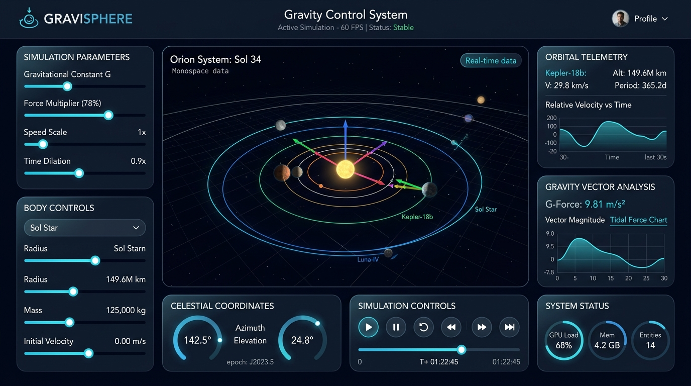

# ⚡ Abhijeet Mahakur — Personal Portfolio & CMS

<div align="center">



### **Next-Generation Full-Stack Engineering Portfolio with Embedded CMS & AI Assistant**

[](https://github.com/abhijeetmahakur/Personal_Portfolio)
[](https://developer.mozilla.org/en-US/docs/Web/JavaScript)
[](https://nodejs.org/)
[](https://expressjs.com/)
[](https://vitejs.dev/)

[Features](#-key-features) • [Tech Stack](#-technology-stack) • [Getting Started](#-getting-started) • [Environment Setup](#-environment-variables) • [Architecture](#-system-architecture) • [License](#-license)

</div>

---

## 🌟 Overview

This repository houses the source code for **Abhijeet Mahakur's** personal portfolio—a high-performance, responsive full-stack web application designed with a sleek dark glassmorphism aesthetic. It combines cinematic scroll-driven canvas animations with a real-time headless CMS engine, robust dual-method administrative authentication, and an interactive portfolio AI assistant.

---

## 🚀 Key Features

### 🎨 Visuals & Frontend Experience
- **Cinematic Canvas Scroll Animation:** Frame-by-frame canvas animation synchronized with **Lenis** smooth scrolling.
- **Glassmorphism UI:** Modern dark mode palette with backdrop filters, gradient glows, and fluid micro-interactions.
- **Dynamic Portfolio Vault:** Interactive modal with real-time search, category filtering (AI/ML, Web, Python, Systems), and full case studies.
- **Verified Credentials Showcase:** Centralized credentials section with document previews and issuer verification.
- **Embedded AI Chatbot:** Interactive assistant that answers visitor questions regarding projects, technical skills, and experience.

### ⚙️ Full-Stack CMS & Admin Suite
- **Dynamic Data Hydration:** Instant live updates across all sections (Bio, Skills, Projects, Experience, Certificates) without rebuilding frontend assets.
- **Dual-Layer Admin Authentication:**
  - **Google OAuth 2.0:** Single-sign-on restricted to authorized admin emails.
  - **Passwordless OTP:** 6-digit one-time passcode delivered directly via Gmail SMTP pool, with fallback Master PIN protection.
- **Admin Dashboard:** Full CRUD management for projects, skills, certifications, and personal metadata.
- **Newsletter & Contact Dispatch:** Automated contact inquiries and newsletter subscriptions with instant confirmation emails.

---

## 🛠️ Technology Stack

| Layer | Technologies |
|---|---|
| **Frontend** | HTML5, Modern CSS3 (Variables, Flexbox/Grid, Glassmorphism), Vanilla JavaScript (ES Modules) |
| **Animation & UX** | Lenis Smooth Scroll, HTML5 Canvas 2D Rendering Engine |
| **Backend & API** | Node.js, Express.js (REST API, CORS, Session Management) |
| **Authentication** | Google OAuth 2.0 (`googleapis`), Gmail SMTP OTP Verification |
| **Build & Tooling** | Vite, Multer (File & Asset Uploads), Nodemailer |

---

## 📂 Project Structure

```bash
Portfolio/
├── .env.example             # Environment variable template
├── .gitignore               # Excludes secrets, node_modules, and cache
├── index.html               # Main portfolio landing page
├── admin.html               # CMS Admin authentication & management portal
├── style.css                # Core design system, glassmorphism styles & animations
├── portfolio-cms.js         # Frontend CMS hydration & modal logic
├── admin-cms.js             # Admin dashboard operations & authentication logic
├── script.js                # Canvas scroll sequence & interactive behaviors
├── package.json             # Project dependencies and npm scripts
├── scripts/
│   └── dev.js               # Concurrently runs Vite frontend and Express backend
├── server/
│   ├── server.js            # Express API server & authentication endpoints
│   ├── data.json            # CMS data store for portfolio content
│   └── uploads/             # Media storage for uploaded credentials & avatars
└── public/                  # Static assets, project previews & icons
```

---

## 🏁 Getting Started

### Prerequisites
- [Node.js](https://nodejs.org/) (v18.0.0 or higher recommended)
- [npm](https://www.npmjs.com/) (bundled with Node.js)
- [Git](https://git-scm.com/)

### Installation

1. **Clone the repository:**
   ```bash
   git clone https://github.com/abhijeetmahakur/Personal_Portfolio.git
   cd Personal_Portfolio
   ```

2. **Install dependencies:**
   ```bash
   npm install
   ```

3. **Configure Environment Variables:**
   Copy the example environment file:
   ```bash
   cp .env.example .env
   ```
   Edit `.env` and fill in your configuration (see [Environment Variables](#-environment-variables) below).

4. **Launch the development server:**
   ```bash
   npm run dev
   # Or directly: node scripts/dev.js
   ```

5. **Access the application:**
   - **Portfolio Frontend:** [http://localhost:5173](http://localhost:5173)
   - **Backend API:** [http://localhost:3001](http://localhost:3001)
   - **Admin CMS Portal:** [http://localhost:5173/admin.html](http://localhost:5173/admin.html)

---

## 🔐 Environment Variables

Create a `.env` file in the root directory using the template provided in `.env.example`:

```env
# Server Configuration
PORT=3001
VITE_DEV_ORIGIN=http://localhost:5173
AUTHORIZED_ADMIN_EMAIL=your_email@gmail.com

# Google OAuth 2.0 Web Client Credentials
GOOGLE_CLIENT_ID=your_google_client_id.apps.googleusercontent.com
GOOGLE_CLIENT_SECRET=your_google_client_secret
GOOGLE_REDIRECT_URI=http://localhost:3001/api/auth/google/callback

# Email / OTP Delivery Configuration (Gmail App Password)
GMAIL_USER=your_email@gmail.com
GMAIL_APP_PASSWORD=your_gmail_app_password
ADMIN_MASTER_PIN=000000
```

> **Security Note:** Never commit your `.env` file to version control. It is protected by `.gitignore`.

---

## 📌 Featured Projects

- **[GraviSphere](https://github.com/abhijeetmahakur/gravisphere)** — Real-time interactive 3D celestial gravity simulation and physics workstation.
- **[Air Writing](https://github.com/abhijeetmahakur/air_writing)** — Contactless computer vision writing system using Python, OpenCV, and MediaPipe hand landmark tracking.
- **[Django Blog Website](https://github.com/abhijeetmahakur/Django)** — Full-stack database-driven publishing platform implementing Model-View-Template architecture with ORM queries and role authentication.
- **[AttendanceApp](https://github.com/abhijeetmahakur/AttendanceApp)** — Automated student attendance tracking system with database integration.
- **[ThermaX](https://github.com/abhijeetmahakur/ThermaX)** — High-performance thermodynamic simulation and thermal analysis engine.

---

## 📬 Connect with Me

- **GitHub:** [@abhijeetmahakur](https://github.com/abhijeetmahakur)
- **LinkedIn:** [Abhijeet Mahakur](https://linkedin.com/in/abhijeet-mahakur-23bb983b6)
- **Email:** [abhijeetmahakur67@gmail.com](mailto:abhijeetmahakur67@gmail.com)

---

## 📄 License

This project is open source and available under the [MIT License](LICENSE).
